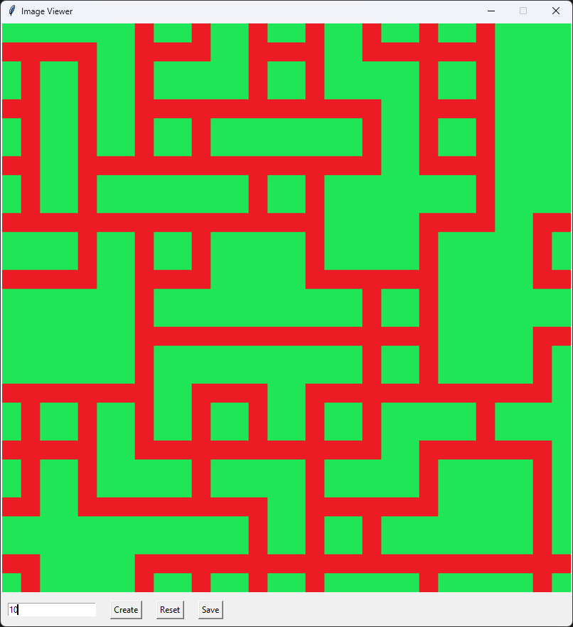

# PyWaveCollapse

PyWaveCollapse is a Python implementation of the Wave Function Collapse algorithm for generating tile-based maps with custom placement rules. It also provides a user-friendly tkinter interface for easier use and the ability to save the created map as a PIL image.

## Screenshots

## Prerequisites

Make sure to install the following module:

- PIL (Python Imaging Library)

## Isues

* The algorithm is not always working as intended (sometimes it places tiles incorrectly).
* There are too many comments (used for understanding mistakes, need to be removed after fixing the code).